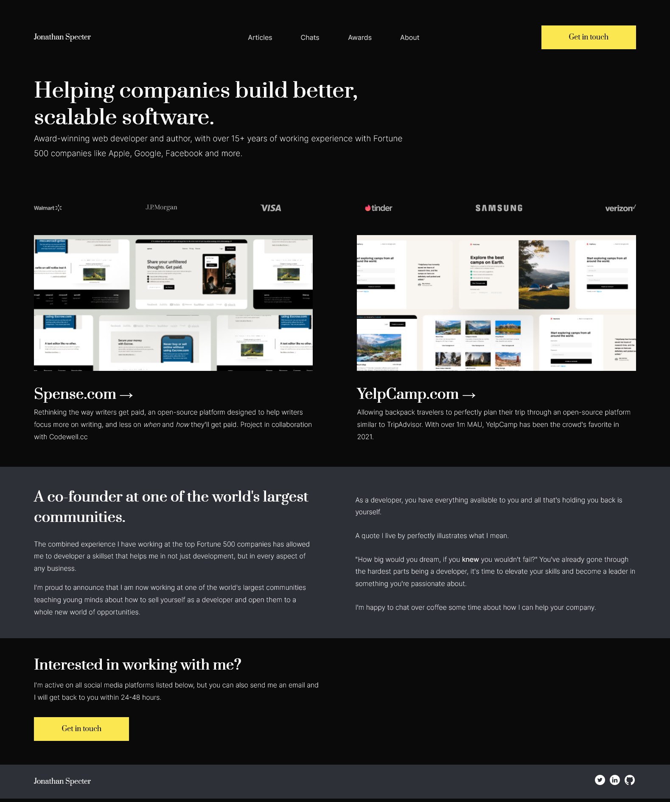

_This README.md file is in English and Portuguese. // Esse arquivo README.md está em Inglês e Português._

# EN: codewell-landing-page

This repository contains my "replica" of a landing page.

The landing page is actually a challenge from the [Codewell](https://www.codewell.cc/) platform. This platform aims to help you improve your HTML, CSS and Javascript skills by giving you websites (and all items needed) to replicate using your favorite Editor. Three versions of the website are given: **desktop, tablet and mobile**.

⚠️ _I do not own the website or its design_. ⚠️

### CHALLENGE
Click [here to see it](https://www.codewell.cc/challenges/web-developer-portfolio--617d4897a383e41090a3e46f).

### MY DESKTOP VERSION

# PT: codewell-landing-page

# codewell-landing-page

Esse repositório contém a minha "réplica" de uma landing page.

Essa landing page, na verdade, é um desafio da plataforma [Codewell](https://www.codewell.cc/). Essa plataforma busca te ajudar a melhorar suas habilidades em HTML, CSS e Javascript ao te dar websites (e todos os itens necessários, em um arquivo ZIP) para você replicar no seu Editor favorito. Três versões do site são dados: **desktop, tablet e mobile**. 

⚠️ _Eu não sou dona do website ou do seu design_. ⚠️

This repository contains my "replica" of a landing page.

The landing page is actually a challenge from the  platform. This platform aims to help you improve your HTML, CSS and Javascript skills by giving you websites (and all items needed) to replicate using your favorite Editor. Three versions of the website are given: **desktop, tablet and mobile**.

### DESAFIO
Clique [aqui para vê-lo](https://www.codewell.cc/challenges/web-developer-portfolio--617d4897a383e41090a3e46f).

### MINHA VERSÃO DESKTOP

